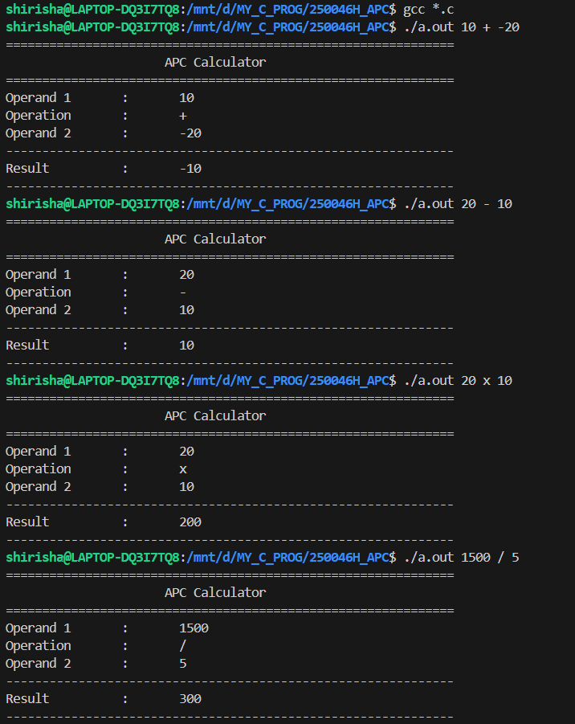
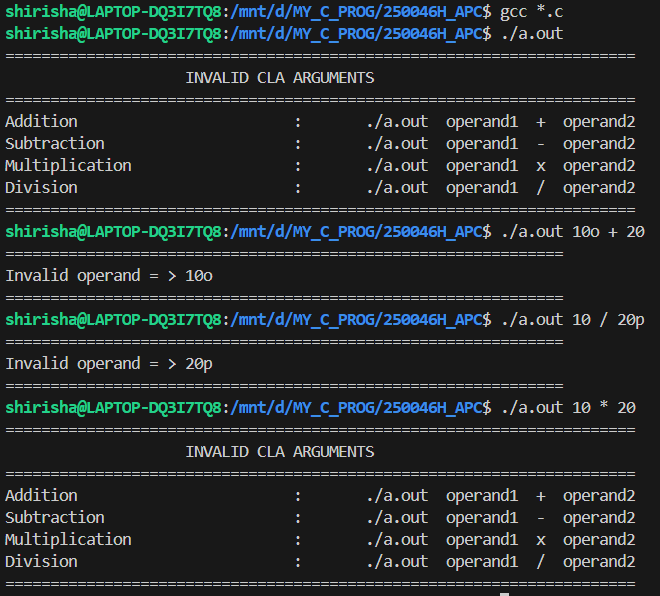

# Arbitrary Precision Calculator (APC) in C

## Overview
This project is an **Arbitrary Precision Calculator (APC)** implemented in **C**, which performs arithmetic operations on very large numbers that cannot be handled by standard data types like `int` or `long`.

The calculator supports:
- Addition
- Subtraction
- Multiplication
- Division  

by processing numbers digit-by-digit using **linked lists**.

---

## Features
- Handles integers of **any length**
- Supports basic arithmetic operations:
  - Addition
  - Subtraction
  - Multiplication
  - Division
- Modular and well-structured code
- Written using pure **C language**
- Demonstrates strong understanding of **data structures**

---

## Technologies Used
- C Programming Language
- Linked Lists
- Modular Programming

---

## Project Structure
- main.c // Entry point of the program
- apc.h // Header file with structure definitions and function prototypes
- add.c // Addition logic
- sub.c // Subtraction logic
- mul.c // Multiplication logic
- div.c // Division logic


---

## How It Works
- Each digit of the number is stored in a node of a linked list.
- Arithmetic operations are performed similar to manual calculations.
- The result is generated as a linked list and printed to the console.

---

## How to Compile and Run
Use the following commands in the terminal:

```bash
gcc main.c add.c sub.c mul.c div.c -o apc
./apc

## Screenshots

### Operations


### Validations


